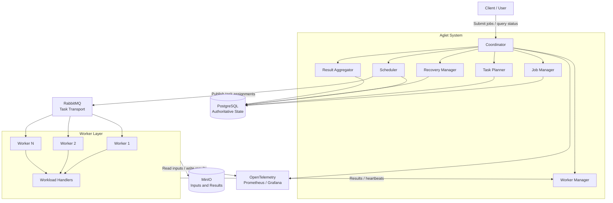

# HLD of the project idea

```mermaid
flowchart TD
    User[Client / User]

    subgraph Aglet[Aglet System]
        Coordinator[Coordinator]
        JobManager[Job Manager]
        TaskPlanner[Task Planner]
        Scheduler[Scheduler]
        WorkerManager[Worker Manager]
        RecoveryManager[Recovery Manager]
        ResultAggregator[Result Aggregator]
    end

    subgraph Workers[Worker Layer]
        Worker1[Worker 1]
        Worker2[Worker 2]
        WorkerN[Worker N]
        Handlers[Workload Handlers]
    end

    StateStore[(PostgreSQL<br/>Authoritative State)]
    MessageBroker[RabbitMQ<br/>Task Transport]
    ObjectStorage[(MinIO<br/>Inputs and Results)]
    Observability[OpenTelemetry<br/>Prometheus / Grafana]

    User -->|Submit jobs / query status| Coordinator
    Coordinator --> JobManager
    Coordinator --> TaskPlanner
    Coordinator --> Scheduler
    Coordinator --> WorkerManager
    Coordinator --> RecoveryManager
    Coordinator --> ResultAggregator

    JobManager --> StateStore
    TaskPlanner --> StateStore
    Scheduler --> StateStore
    RecoveryManager --> StateStore
    ResultAggregator --> StateStore

    Scheduler -->|Publish task assignments| MessageBroker
    MessageBroker --> Worker1
    MessageBroker --> Worker2
    MessageBroker --> WorkerN

    Worker1 --> Handlers
    Worker2 --> Handlers
    WorkerN --> Handlers

    Workers -->|Results / heartbeats| WorkerManager
    Workers -->|Read inputs / write results| ObjectStorage
    Coordinator --> Observability
    Workers --> Observability
```
